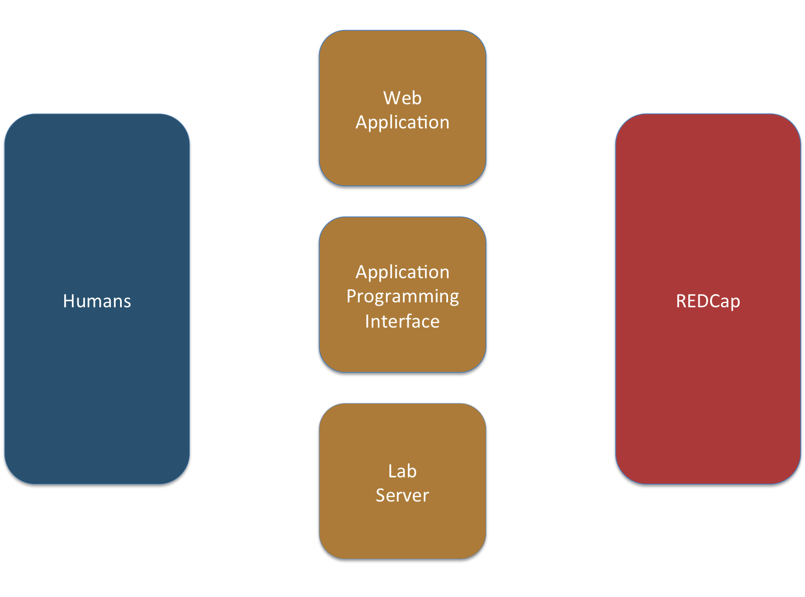
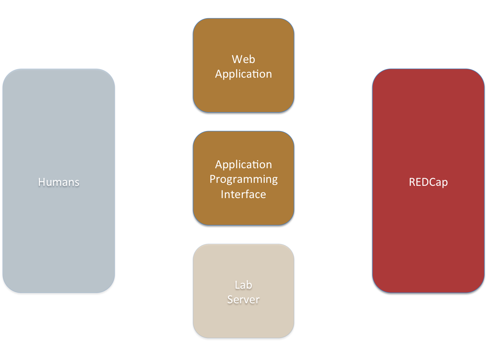
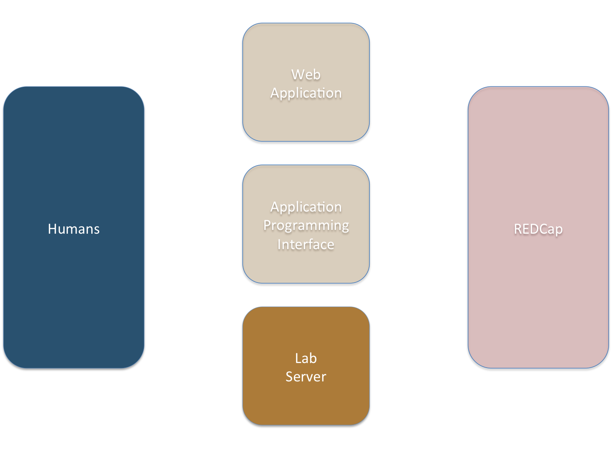
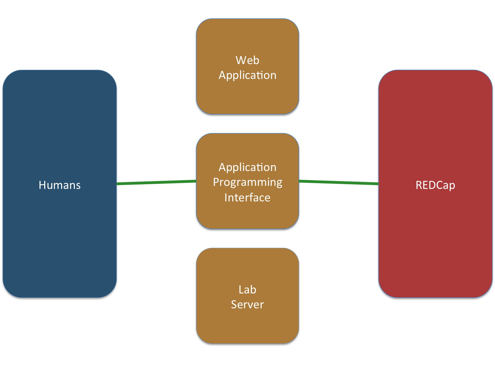
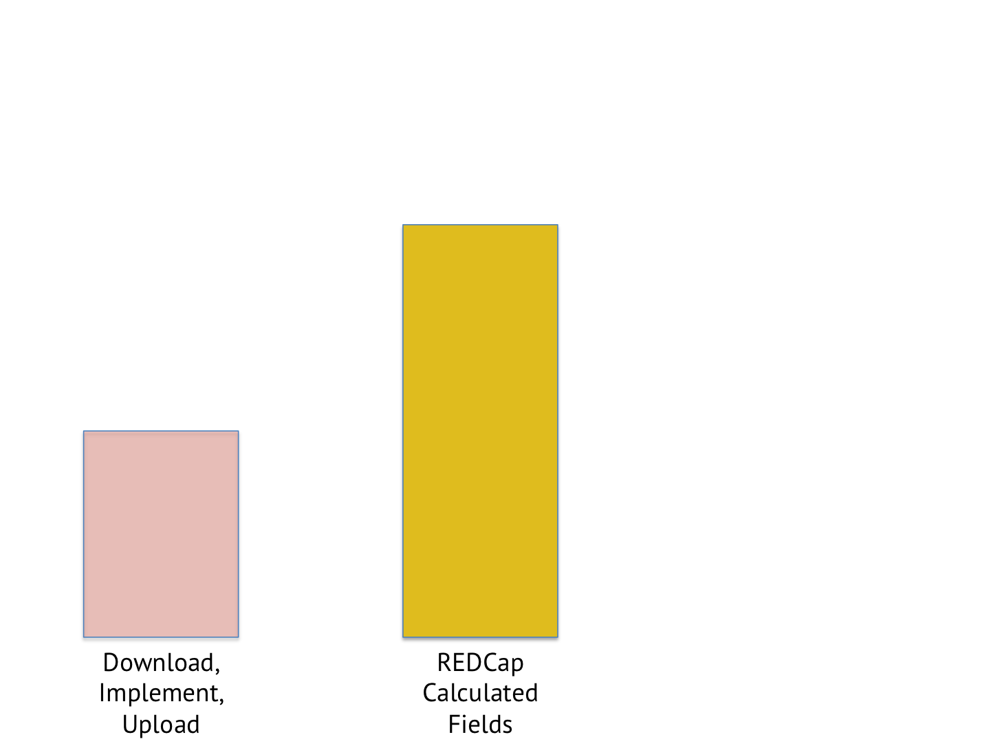
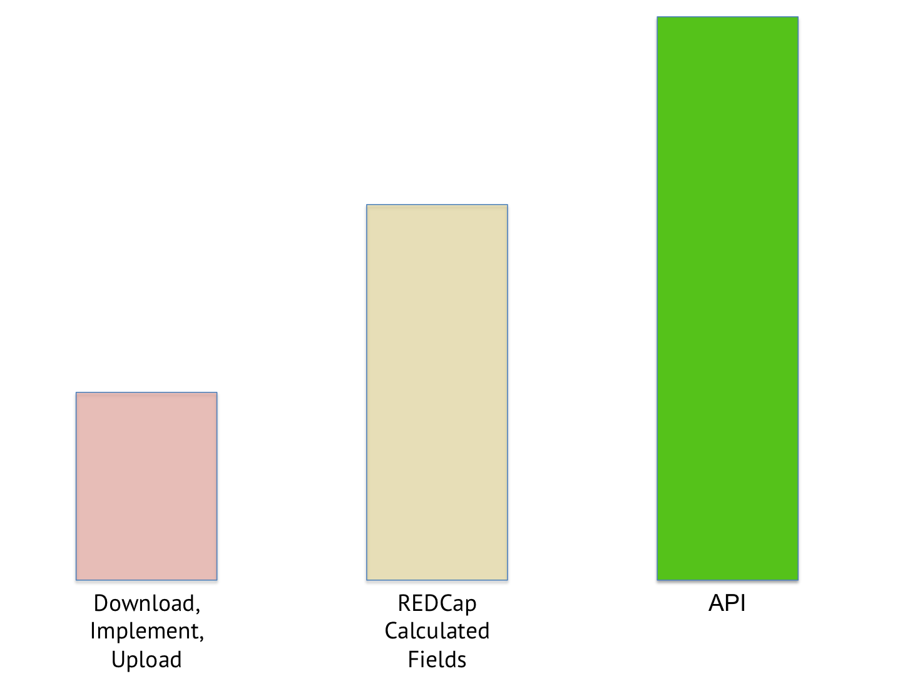
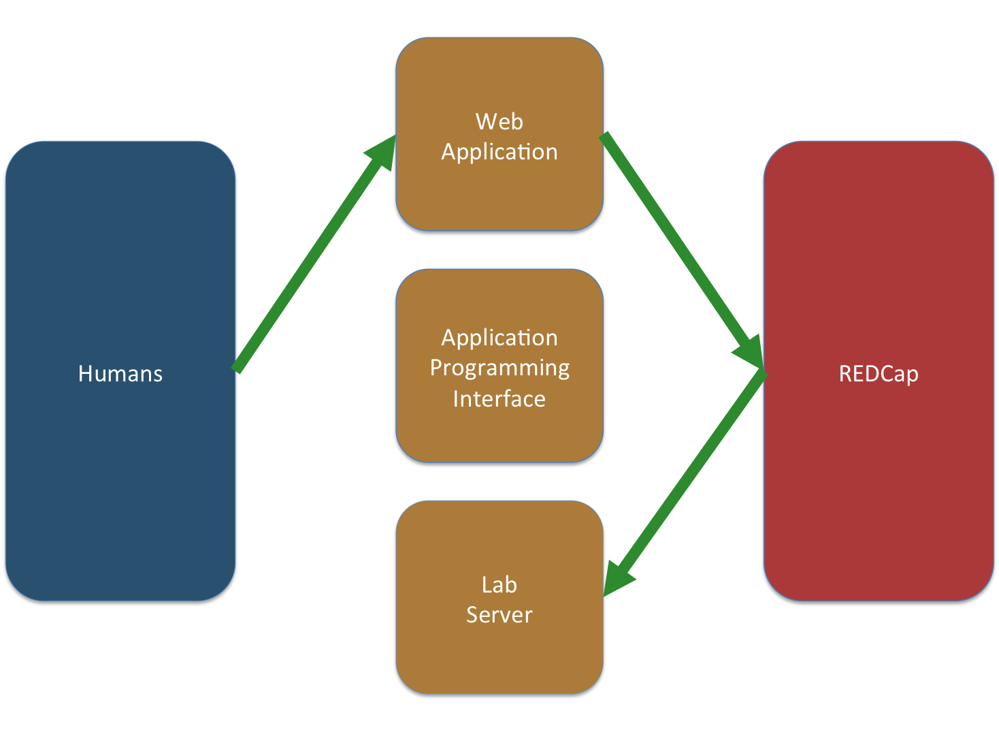
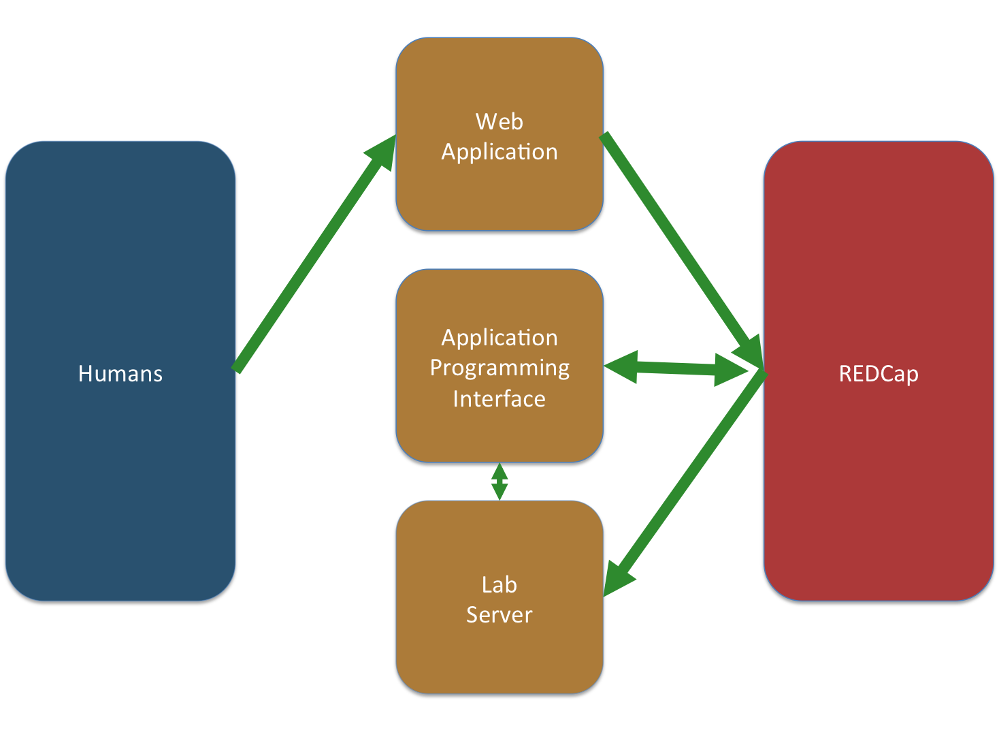
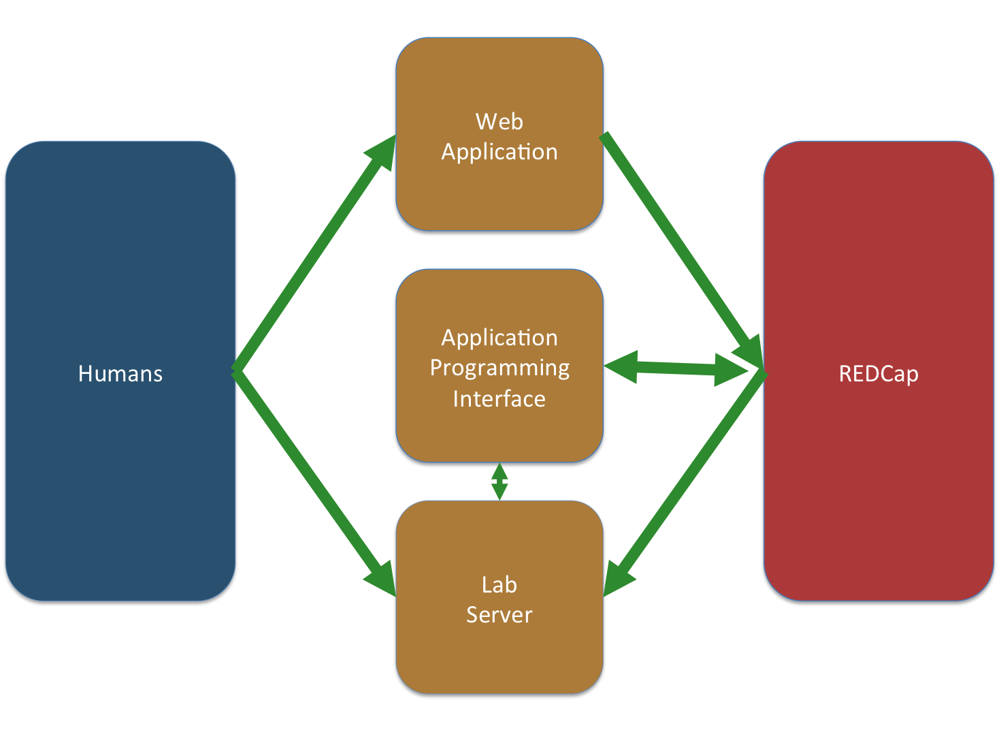

# Improving Research through Advanced REDCap Interfaces

 

## scott.s.burns@vanderbilt.edu

(Notes & Code Samples in the handouts)

`http://github.com/sburns/advanced-redcap-interfaces`
`http://bit.ly/advanced-redcap`

## Presenter Notes

I'm an open book, this talk can be found on my github.

A rendered version can be found at the bit.ly URL.

Ratio of coders to non-coders?

The handouts have my talking points. Where applicable, they also contain code samples. I hope you find this useful.

I have no affiliation with REDCap other than I submit a lot of bug reports, though less recently which is a good thing.

---

# At EBRL

We study reading disabilities in **children** using behavior and imaging measures.

 

## Very wide databases

---

# At EBRL

We study reading disabilities in **children** using behavior and imaging measures.

 

## Very expensive datasets

---

# At EBRL

We study reading disabilities in **children** using behavior and imaging measures.

 

## Novel tasks (in & out of magnet)

---

# At EBRL

We study reading disabilities in **children** using behavior and imaging measures.

 

## Many Projects

---

# Before...

*   Lab members touched every piece of data.
*   Issues and effort to join data across paradigms.
*   Stored data in spreadsheets.
*   Always behind in data analysis.
*   No traceable analyses.
*   Copy/Paste from Excel to REDCap.

## Rate of Input >> Rate of Output

---

# ...after

*   Moved **as much as possible** to REDCap projects.
*   We analyze some data within (milli-) seconds of capture.
*   Automate everything.
*   Automate the automation.
*   Start analyses from a single source.

## Presenter Notes

If it's not in REDCap, it doesn't exist.

Store absolutely everything in REDCap. Capture experimental tasks in there.

Automate the automation. People run advanced analyses and they don't even konw it.

Humans touch data as little as possible, most especially after the collection process.

---

# Goals

 
 

## REDCap provides advanced features but doesn't talk about them

## Presenter Notes

I want to talk about them because I think they're both important and extremely powerful.

---

# Goals

 
 

## These features make possible advanced data management workflows

## Presenter Notes

These workflows can span the entire range of research and are limitless.

We have the tools to put our machines to better use, it's time to use them to improve our science/research.

---

# Goals

 
 

## Provide some example workflows our lab has created

## Presenter Notes

If your head isn't swimming with ideas about how to improve your research, I haven't done my job.

---

# Advanced data manag...what?

 

## In an ideal world

Machines peform all **definable** data analyses because they:

*   Perform reproducible work.
*   Are extremely cheap.
*   Operate deterministically.

## Presenter Notes

As opposed to humans who:

*   Cannot be relied upon to reproduce their own work.
*   Are extremely expensive.
*   Some RAs might even be considered pseudorandom processes.

Keyword here is definalbe...machines can only follow a set of rules.

If you can't express a rule for the analysis, a human must do it.

Otherwise, a machine **should** do it.

---

# REDCap is...

 

## ...a data storage service

 

## ...secure for the storage of PHI

 

## ...an online spreadsheet

## Presenter Notes

Just to get everyone on the same page

---

# REDCap is "less" than...

 

## ...a "real" database:

- Not relational, can only track one "entity" per project
- Each Project is only a single table

## Presenter Notes

REDCap does not support traditional database features as found RDBMS like Oracle, MySQL, etc.

Namely, it is not relational. A REDCap project can only track single "entities".

Other databases let you add fancy relationships (one-to-one, one-to-many) to your models.

This decision reduces a lot complexity and I applaud them for it.

---

# REDCap is "more" than...

 

## ...a real database:

- No administration
- Easy schema definition

## ...a spreadsheet:

- Client & Server architecture
- GUI is browser-based
- Advanced web features (why we're here today)

## Presenter Notes

Web application is a front-end to a large server backend.

No installation required on users end.

IMO, REDCap should be judged not as a less capable database but as a super spreadsheet that insulates users from many of the pitfalls of file-based tabular databases.

We're here today to talk about these advanced web features

---

# Vocabulary

 

<table>
    <thead>
        <tr>
            <th class="left"><strong>REDCap</strong></th>
            <th><strong>SQL/Excel/etc</strong></th>
        </tr>
    </thead>
    <tbody>
        <tr>
            <td class="left">Project</td>
            <td>Table</td>
        </tr>
        <tr>
            <td class="left">Data Dictionary</td>
            <td>Schema</td>
        </tr>
        <tr>
            <td class="left">Record</td>
            <td>Row</td>
        </tr>
        <tr>
            <td class="left">Field</td>
            <td>Column</td>
        </tr>
        <tr>
            <td class="left">Form or Instrument</td>
            <td>Set of columns</td>
        </tr>
        <tr>
            <td class="left">Unique Identifier</td>
            <td>Primary Key, Index, etc</td>
        </tr>
    </tbody>
</table>

---

# General Architecture

 

## Presenter Notes

Generally speaking, we're working with these components.

---

# General Architecture (REDCap)

 

## Presenter Notes

What most of us think of REDCap is really the front-end website. It presents the GUI of REDCap.

It facilitaties all data saves/download requests/etc to the REDCap back-end server application.

There's also the API which can be thought of more like a CLI. It provides programmatic means to access the server application.

---

# General Architecture (You)

 

I'll assume that research group is comprised of lab members (the humans) and one or more general purpose (hopefully secure) machines to do the lab's bidding.

---

# Advanced REDCap Features

 

## Application Programming Interface

Programmatic access to push to/pull from REDCap

## Data Entry Triggers

Notifications across the internet whenever data is saved

**These features are the building blocks of extremely advanced data managment techniques and they're ready to use right now.**

## Presenter Notes

**These two features make REDCap the foundation for advanced data management workflows**

Investing in these workflows will improve your work. The techincal details of how these two features work are less important than the workflows they enable, which I'll talk about towards the end.

---

# Application Programming Interface

A way for software programs to ask for and push data to REDCap projects.

Instead of downloading/uploading data through the GUI, we can let scripts and applications to do it for us.

---

# API

 

---

# API

## HTTP POST to API URL

`https://redcap.vanderbilt.edu/api/`

## Any programming language with a HTTP library can communicate with REDCap.

**PyCap** facilitates using the REDCap API within python applications.

Documentation @ `http://sburns.github.io/PyCap`

## Presenter Notes

HTTP-based API for communicating with Projects

Aside: when you go to google.com, your browser submits a GET request. When you press the "search" button, your browser submits a POST request. A different way to submit information across the web.

All languages worth using have an http library.

In-/output formats: `csv`, `xml`, `json`

You'll find code snippets on the handouts, bash on top and python below

To install pycap `$ pip install PyCap`

API Documentation from REDCap `https://redcap.vanderbilt.edu/api/help/`

---

# API: What can it do for you?

 

## Export Data-Dictionary

## Presenter Notes

A table about your table. Useful to determine whether fields exist before imports/etc.

Equivalent to downloading the data dictionary through the web application.

    !bash
    $ curl -X POST https://redcap.vanderbilt.edu/api/ \
        -d token=XXX \
        -d content=metadata \
        -d format=json

 

    !python
    from redcap import Project
    project = Project('https://redcap.vanderbilt.edu/api/', TOKEN)
    md = project.export_metadata()

---

# API: What can it do for you?

 

## Export & Import Records

## Presenter Notes

Download the entire database

Can also request certain fields or records

Honors access rules (keeps PHI safe)

    !bash
    $ curl -X POST https://redcap.vanderbilt.edu/api/ \
        -d token=XXX \
        -d content=record \
        -d format=csv
    $ curl -X POST https://redcap.vanderbilt.edu/api/ \
        -d token=XXX \
        -d content=record \
        -d format=csv \
        -d records=1,2,3 \
        -d fields=age,sex,gender

 

    !python
    data = project.export_records()
    # data is a list of dictionary objects with one dictionary per record
    csv = project.export_records(format='csv') # or 'xml'
    df = project.export_records(format='df')  # Pandas DataFrame
    sliced = project.export_records(records=['1', '2', '3'],
                                    fields=['age', 'sex', 'gender'])

Getting a DataFrame is really helpful because pandas automatically provides type coercion in the DF construction (a text field column that stores numbers -> floats)

Update fields for existing records

Add new records on the fly

    !bash
    $ curl -X POST https://redcap.vanderbilt.edu/api/ \
        -d token=XXX \
        -d content=record \
        -d format=csv \
        -d data="participant_id,new_data\n1,hooray"

 

    !python
    project.import_records([{'participant_id': '1', 'new_data': 'hooray'}])
    # Or upload many records at once
    from my_module import modify_records
    data = project.export_records()
    modified = modify_records(data)
    response = project.import_records(modified)
    assert response['count'] == len(modified)  # Just to make sure

---

# API: What can it do for you?

 

## Export, Import and Delete Files

## Presenter Notes

Download

    !bash
    $ curl -X POST https://redcap.vanderbilt.edu/api/
        -d token=XXX \
        -d returnFormat=json \
        -d content=file \
        -d action=export \
        -d record=1 \
        -d field=file > exported_file.txt

 

    !python
    content, headers = project.export_file(record='1', field='file')
    # write out a new file using the filename as stored in REDCap
    with open(headers['name'], 'w') as f:
        f.write(content)

Importing

    !bash
    $ curl -X POST https://redcap.vanderbilt.edu/api/
        -d token=XXX \
        -d returnFormat=json \
        -d content=file \
        -d action=import \
        -d record=1 \
        -d field=file \
        -d file=@localfile.txt

    !python
    local_fname = 'to_upload.pdf'
    with open(local_fname, 'rb') as fobj:
        response = project.import_file(record='1', field='file',
                                       fname=local_fname, fobj=fobj)
    # Whatever is passed to the fname argument will appear in the REDCap UI

Deleting

    !bash
    $ curl -X POST https://redcap.vanderbilt.edu/api/
        -d token=XXX \
        -d returnFormat=json \
        -d content=file \
        -d action=delete \
        -d record=1 \
        -d field=file \

    !python
    project.delete_file('1', 'file')

---

# API: Possible Uses

 
## Advanced & Automated Field Calculations

 

## REDCap as an interface for other systems/processes of research

 

## Shared filesystem

**(not an exhaustive list!)**

---

# API: Advanced Field Calculations

## Problem: Update Many Records By Applying Formula

## Presenter Notes

Your PI just came to you and said she wants to calculate a field based on the values of many others. There's probably some advanced logic/look up tables required.

*   Download the data as spreadsheet/SPSS/etc.
*   Implement the field calculation and execute.
*   Re-upload data.

**Why this is bad**

*   Must re-do the process for each new record.
*   Can you trust who ever does this to always do it perfectly? Or are we introducing bias?
*   Delete the spreadsheet and a piece of the methods section potentially goes to the trash.

---

# API: Advanced Field Calculations

## Problem: Update Many Records By Applying Formula

## Presenter Notes

**While REDCap does provide a calculated field feature, their implementation has issues**

*   Implemented as Javascript, requires viewing the field in the web app for the calculation to execute.
*   No access to third-party code (statistics/conversion tables/etc)
*   Must re-implement across Projects. Somewhat mediated by using the same data dictionary.

What if you have hundreds/thousands of records? Some poor RA has to view and save each record.

---

# API: Advanced Field Calculations

## Problem: Update Many Records By Applying Formula

## Presenter Notes

*   Write the (testable!) implementation once
*   Easily use against many projects
*   Fast, Error-Free IO of the calculated fields
*   Upfront cost amortized across all automated calculations

Software testing in academia is for another talk, but do you really want to publish using untested methodologies?

Using the API, we can write and test advanced field calculations once and apply them across projects easily.

While the calculation itself is probably no faster than when a human does it in excel/spss, we save time, energy and reduce mistakes in the download/upload process.

And we're free to implement whatever logic necessary.

---

# API: External Research Systems

 
## Hooks to external databases

 
## Reproducible group/cohort determination

 
## Automated database cleanup

## Presenter Notes

*   A major thrust of our work is neuroimaging in children.
*   We use REDCap as an interface for our image processing backend that runs at ACCRE.
*   Imaging Data is record-aligned with behavioral data we store in REDCap.

This is difficult to explain/talk about generally, but REDCap did a lot of hard work in making a nice UI for humans to input generic data.

The API presents a stationary target that other systems can be written against to grab information and use it to perform "business logic".

Reduces Friction between researchers and their data.

Use the same analyses for pilot and production data.

Theoretically, your research software that uses the REDCap API is documented, tested and should help write the Methods sections.

---

# API: A Shared Filesystem

 

## How do we connect *intermediate* data to our analysis infrastructure?

REDCap `file` fields!

## Presenter Notes

Some experiments necessarily produce intermediate files. We want to analyze these files and put results in REDCap.

We can use file fields to simplify the connection to our analysis infrastructure.

---

# API: A Shared Filesystem

**A general approach**

*   Lab member runs test, uploads intermediate file to specific field
*   Automated program exports file to local filesystem
*   Automated program analyses and uploads results to REDCap

**No need to share a filesystem**

*   Disconnect an unsecure environment (the lab member) from an environment with potential PHI (where the analysis runs).
*   The automated program can also organize files better/faster/cheaper than any human.

## Presenter Notes

We use eprime, an application for making and running experimental psychological tests.

It spits out files with subject input, etc.

These files are raw data that need to be analyzed, and the results should go to redcap. We want to then store the file for "safe keeping".

---

# API: A Shared Filesystem

**What about the other direction?**

Given a record in the database:

*   An automated program can produce a novel file based on the record
*   Upload it to REDCap (safely move PHI)
*   Alert lab members of the file creation

## Presenter Notes

Doing manually, these reports take long amounts of time to do well. Pronouns/actual scores/etc. On average about 2-3 hours per report a human could be doing other things.

Using the data export and file upload methods, we can create these reports automatically and store the resulting file in REDCap so other lab members have access to them.

---

# API

 

## Presenter Notes

I've only scratched the surface here. The possibilities of workflows enabled by the API are essentially limitless.

The API provides all of the low level pieces.

---

# API: Pitfall (by design)

 

## API usage is driven by external requests

Poll? (yuck)

 

## Better idea about when to run analyses?

---

# Data Entry Triggers

 

## Independent but Complimentary Feature to the API

*   Register a single URL to your Project
*   ANY Form save --> HTTP POST request to URL.

---

# Data Entry Triggers

 

---

# Data Entry Triggers

---

# Data Entry Triggers

## Presenter Notes

*   Deploy arbitrary data workflows on a webserver
*   Workflows execute in real time as data is saved.
*   Otherwise normal users can execute very advanced processing.
*   "It just happens"

---

# Data Entry Triggers: Fake Requests

## Presenter Notes

Fake the incoming payload, blast off **many** analyses.

**Fields in the incoming payload:**

*   `project_id`: Project Identifier
*   `instrument`: What form was saved?
*   `record`: Which record?
*   `redcap_event_name`: For which event (longitudinal projects only)
*   `redcap_data_access_group`: What "kind" of user saved it?
*   `[instrument]_complete`: What is the status of the form?

---

# Data Entry Triggers: Pitfalls

 

## Not every research group...

*   ...can setup/maintain/secure a webserver.
*   ...has the resources to write the web application.

## Every lab should have access to this infrastructure

## Presenter Notes

Middleware is required to route incoming requests to the correct workflow

---

# Data Entry Triggers: Switchboard

`switchboard`:

*   Parses incoming `POST` requests from REDCap (or whomever).
*   Executes only the functions whose workflows match the request.

**In Production** for our lab but **rough around the edges**

 
 

(`github.com/sburns/switchboard` want to help?)

---

# Data Entry Triggers

 

## In a perfect world...

A shared "switchboard" webserver:

*   Just one webserver to maintain & protect.
*   Shared infrastructure is good.
*   Remove excuses for groups to use these features.
*   Optimize pieces and all groups benefit.

---

#

 
 
 
 

# In conclusion...

---

# Automation Improves Research
## Automating machines easier than humans

## Presenter Notes

Implementing software against the API is traceable, testable, applicable across many projects

---

# Automate the automation!

## Remove excuses to run analyses

## Presenter Notes

Remove all barriers to running analyses

---

# Thank You

 

---

#

 
 

## scott.s.burns@vanderbilt.edu
## http://github.com/sburns

This talk can be found at:

**Please** email with questions & open issues on my code

 

# Questions?

